# **HealthGuideAI**

**HealthGuideAI** is a personalized wellness assistance platform built with **React** and powered by **Google Gemini AI**.
It generates AI-driven, actionable wellness recommendations based on a user’s profile, goals and specific goal(optional).

---

# **1. Project Setup & Demo**

### **Web Demo Link**

```
https://healthguideai-ai-generated-wellness.onrender.com
```

### **Local Setup**

```bash
git clone https://github.com/Rohit131313/HealthGuideAI.git
cd HealthGuideAI
```

Add .env file with gemini api key
```bash
VITE_GEMINI_API_KEY=your_gemini_api_key
```

Then run the below commands

```bash
npm install
npm run dev
```
Open 
```http://localhost:5173```
---

# **2. Problem Understanding**

The objective was to build an interactive AI-powered wellness system that:

* Captures user information: **Name, Gender, Age, Goal, Specific Focus**
* Uses AI to generate **5 personalized short tips**
* Displays them in a scrollable, card-based interface
* On selecting a tip, generates:

  * A long explanation
  * Step-by-step instructions
  * Expected progress
* Allows users to **save tips locally** for later access


### **Assumptions**

* User age range is restricted to **12–100** for safety
* AI must avoid medical or harmful advice
* **localStorage** is used so "saved tips" persist after refresh
* No backend authentication or user separation

---

# **3. AI Prompts & Iterations**

## **Initial Approach – Zero Shot Prompt**

I first used a simple prompt like:

```Generate 5 wellness tips with title and description.```

Problems faced:

* Short descriptions became broken sentences due to substring cutting
* Formatting varied a lot (markdown, bold, emojis)
* Tips were inconsistent
* UX did not feel clean or professional


## **Refining the Prompts (Final Approach)**

I switched to a **two-prompt architecture**:

### **A) Prompt 1 → Short Tips**

Generates:

* title
* 1 emoji icon
* short_description

### **B) Prompt 2 → Detailed Tip**

Generates:

* long explanation
* steps[]
* expected progress

This made outputs **clean, predictable, and fully structured**.


## **Refinements Through Systematic Prompt Design**

I used a structured prompt-engineering strategy:

### **1. Defined a Clear Role**

AI acts as a **certified wellness coach**.

### **2. Strict Task Definition**

Always return **exactly 5 tips**.

### **3. Strong User Context**

Personalized using:

* name
* gender
* age
* main goal
* specific focus

### **4. Safety Rules**

No medical claims, no promises, no harmful advice.

### **5. Clean Output Format**

Strict **JSON only**, no markdown, no text outside the block.

### **6. Diversity Rule**

All 5 tips must be unique.

### **7. Emoji Constraint**

Icon must be **one real emoji**, no text placeholders.

This produced consistent, clean, and UI-ready AI responses.

---

## **Final Prompts**

### **Prompt for Short Tips**
```
ROLE:
You are a certified wellness and fitness coach with expertise in nutrition, sleep science, mental wellness, and exercise.

TASK:
Generate exactly 5 personalized wellness tips based on the user profile and goals. Each tip should be short, motivational, and actionable.

CONTEXT:
User Profile:
- Name: ${name}
- Gender: ${gender}
- Age: ${age}
- Main Goal: ${mainGoal}
- Specific Focus : ${specificGoal}

Make sure the tips are relevant for the user's age category , user's gender and their selected goal.

REASONING:
First analyze the user's goal and age. Then map the goal to proper wellness categories (nutrition, lifestyle, sleep, fitness, mental wellness). Ensure variety: the 5 tips must not be repetitive.

RULES:
- Do NOT provide medical advice or guaranteed results.
- Do NOT mention exact timelines like "in 10 days".
- You MAY give safe estimations like "most people notice changes in 2–4 weeks".
- Tips must be safe, general, and easy to follow .
- No extreme diets, dangerous exercises, or unrealistic promises.
- All tips must be related to the chosen goal.
- The "icon" must be EXACTLY ONE REAL emoji (e.g., 💡, 🧘‍♀️, 🥗, 🏃‍♂️).
- NEVER return words, labels, or placeholders like child_friendly, running, yoga_pose instead of icon.
- If unsure which icon to choose, use the fallback icon 💡.

STOP CONDITION:
Stop after generating exactly 5 tips.

OUTPUT FORMAT:
Return strictly in the following JSON format:

{
  "tips": [
    {
      "title": "",
      "icon": "",
      "short_description": ""
    }
  ]
}

Make sure there are exactly 5 objects in the array.

IMPORTANT: Output ONLY valid JSON. No explanations, no text outside the JSON.
```

### **Prompt for Detailed Explanation**
```
ROLE:
You are a professional health and wellness coach specializing in practical, safe guidance.

TASK:
Expand the selected wellness tip into a detailed explanation and step-by-step actionable plan that a beginner can follow.

CONTEXT:
Selected Tip Title: ${tipTitle}
User Profile:
- Name: ${name}
- Gender: ${gender}
- Age: ${age}
- Main Goal: ${mainGoal}
- Specific Focus: ${specificGoal}

REASONING:
Explain the science or logic behind the tip in simple language.
Then give a step-by-step actionable plan the user can follow daily or weekly.
Finally, explain what improvements they *may* notice with consistent practice.

RULES:
- DO NOT guarantee results.
- DO NOT mention exact timelines or specific promises.
- You MAY say: “you may notice improvements within a few weeks depending on consistency.”
- No medical claims, no dangerous advice.
- Keep the tone positive, supportive, and simple.

STOP CONDITION:
Stop after completing the step-by-step plan and progress expectations.

OUTPUT FORMAT:
Return strictly in this JSON format:

{
  "long_explanation": "",
  "steps": [
    "",
    "",
    ""
  ],
  "expected_progress": ""
}
IMPORTANT:
Respond ONLY with valid JSON. 
Do not add any commentary, markdown, or text outside the JSON.
```

## **Post-Processing Pipeline**

Before parsing AI output, I applied transformations:

````js
response = response
  .replace(/```json/gi, "")
  .replace(/```/g, "")
  .replace(/\*\*(.*?)\*\*/g, "$1")
  .replace(/\*(.*?)\*/g, "$1")
  .replace(/_{1,3}(.*?)_{1,3}/g, "$1")
  .replace(/`{1,3}(.*?)`{1,3}/g, "$1")
  .replace(/#{1,6}\s?/g, "")
  .trim();
````

This removes:

* Markdown formatting
* Code blocks
* Bold/italic
* Headings
* Backticks
* Extra whitespace

Result:
* JSON is always valid
* UI never breaks
* Typewriter effect works smoothly

---

# **4. Architecture & Code Structure**

### **Frontend – React + Tailwind**

Modular components with reusable UI.

### **State Management**

* `AppContext.jsx` – Stores form data, tips, dark mode
* `PopUpContext.jsx` – Global notifications

### **AI Services**

Located in `src/services/aiService.js`

Handles:

* Prompt building
* API calls
* Response cleaning

### **Local Storage Service**

Located in `src/services/localStorageService.js`

Handles:

* Saving
* Removing
* Fetching stored tips

### **Pages**

* HomePage
* TipDetailPage
* SavedTipsPage
* AboutPage

### **Routing**

Configured in `App.jsx` and `routes.js`.


## **Folder Structure**

```
project-root/
├── node_modules/                  # Auto-installed dependencies (not pushed to repo)
│
├── public/
│   ├── robot.svg                  # App logo used in index.html
│   └── vite.svg                   # Default Vite asset (not used in UI but kept by Vite)
│
├── screenshots/
│   ├──detail-dark-1.png
│   ├──detail-dark-2.png
│   ├──detail-light-1.png
│   ├──detail-light-2.png
│   ├──home-dark.png
│   ├──home-light.png
│   ├──loading-dark.png
│   ├──loading-light.png
│   ├──popup-dark.png
│   ├──popup-light.png
│   ├──saved-dark.png
│   ├──saved-light.png
│   ├──tips-list-dark.png
│   ├──tips-list-light.png
│   
├── src/
│   ├── assets/
│   │   └── react.svg              # Default React asset (optional)
│   │
│   ├── components/
│   │   ├── GoalDropdown.jsx
│   │   ├── InputField.jsx
│   │   ├── Navbar.jsx
│   │   ├── SaveButton.jsx
│   │   ├── SpecificGoalField.jsx
│   │   ├── TipCard.jsx
│   │   ├── TipList.jsx
│   │   ├── TipSkeleton.jsx
│   │   └── TypeWriter.jsx
│   │
│   ├── context/
│   │   ├── AppContext.jsx
│   │   └── PopUpContext.jsx
│   │
│   ├── pages/
│   │   ├── AboutPage.jsx
│   │   ├── HomePage.jsx
│   │   ├── PageNotFound.jsx
│   │   ├── SavedTipsPage.jsx
│   │   └── TipDetailPage.jsx
│   │
│   ├── services/
│   │   ├── aiService.js
│   │   └── localStorageService.js
│   │
│   ├── App.css
│   ├── App.jsx
│   ├── index.css
│   ├── main.jsx
│   └── routes.jsx
│
├── .env                           # Contains VITE_GEMINI_API_KEY (not pushed to repo)
├── .gitignore
├── eslint.config.js
├── index.html
├── package.json
├── package-lock.json
├── README.md
└── vite.config.js

```

---
# **5. Screenshots**

## Home Page
| Light Mode | Dark Mode |
|-----------|-----------|
| 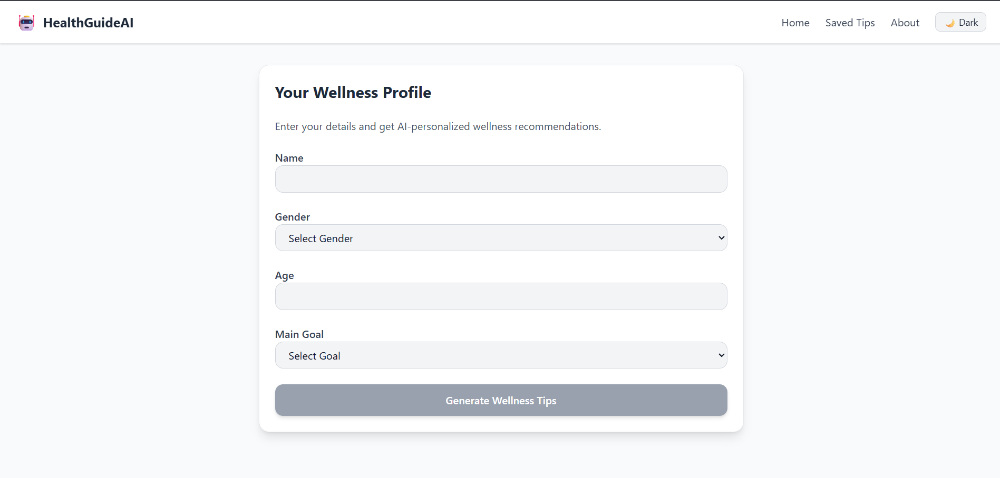 | 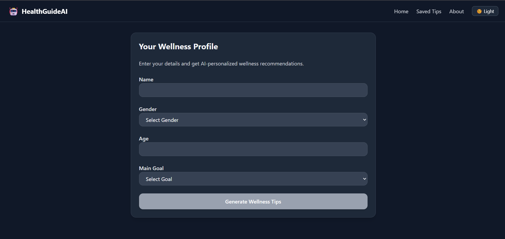 |

---

## Tips Loading (Skeleton)
| Light Mode | Dark Mode |
|-----------|-----------|
| 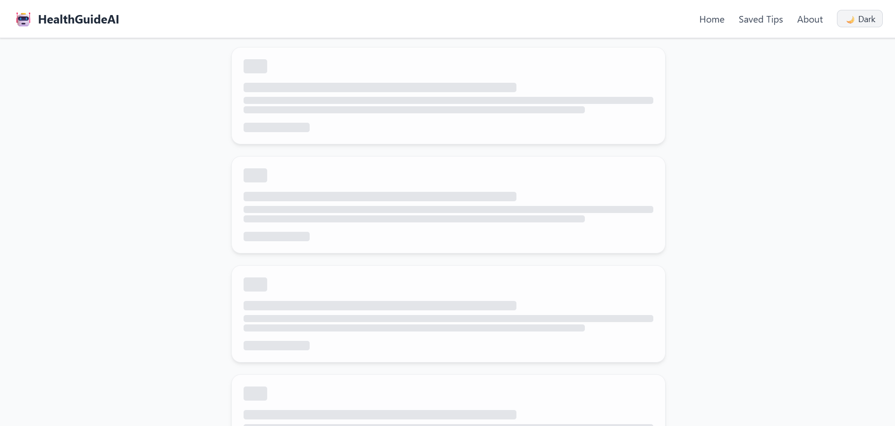 | 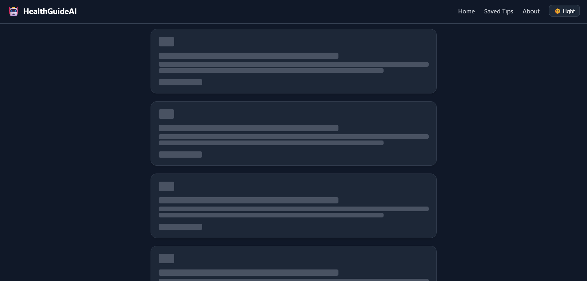 |

---

## Tips List
| Light Mode | Dark Mode |
|-----------|-----------|
| 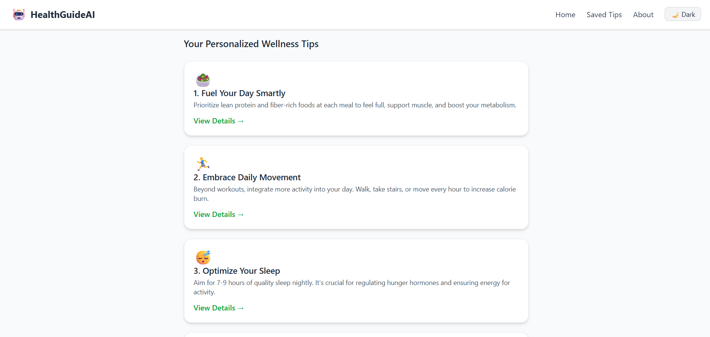 | 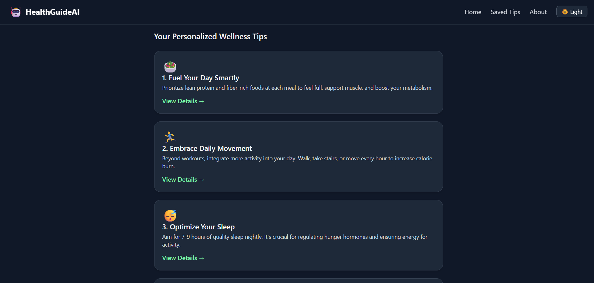 |

---

## Detailed Tip Page 
| Light Mode | Dark Mode |
|-----------|-----------|
| 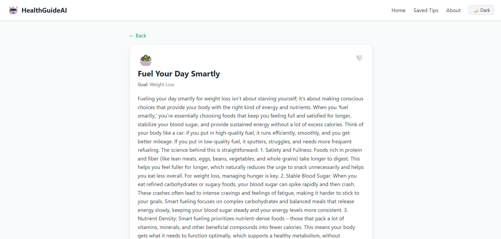 | 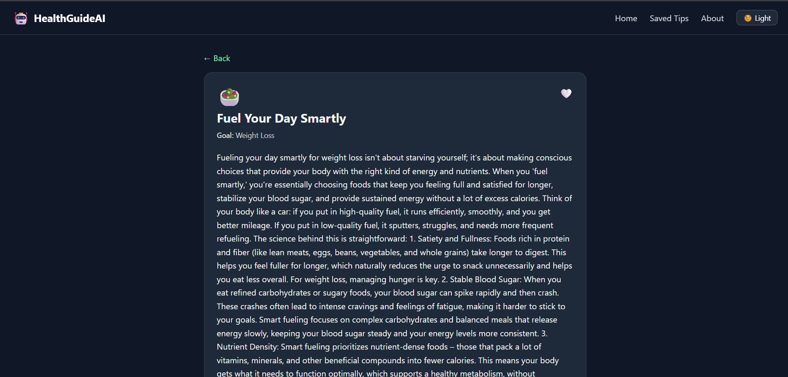 |
|  | 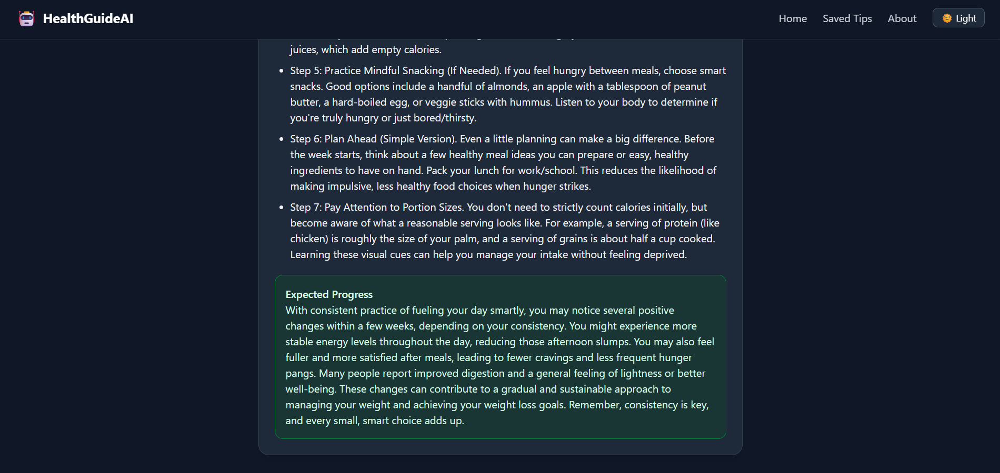 |

---

## Saved Tips
| Light Mode | Dark Mode |
|-----------|-----------|
| 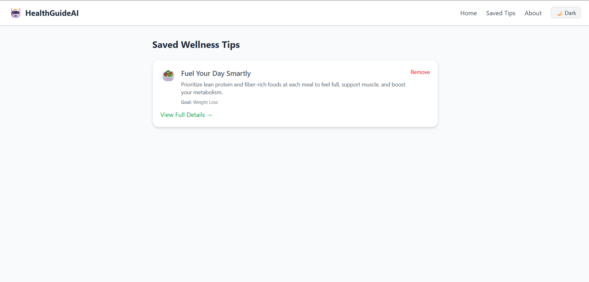 | 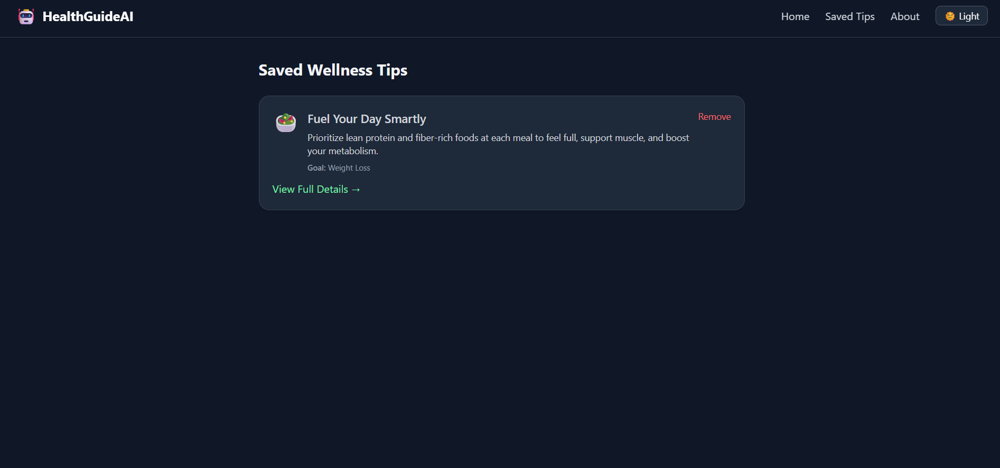 |

---

## Popup Notifications
| Light Mode | Dark Mode |
|-----------|-----------|
|  | 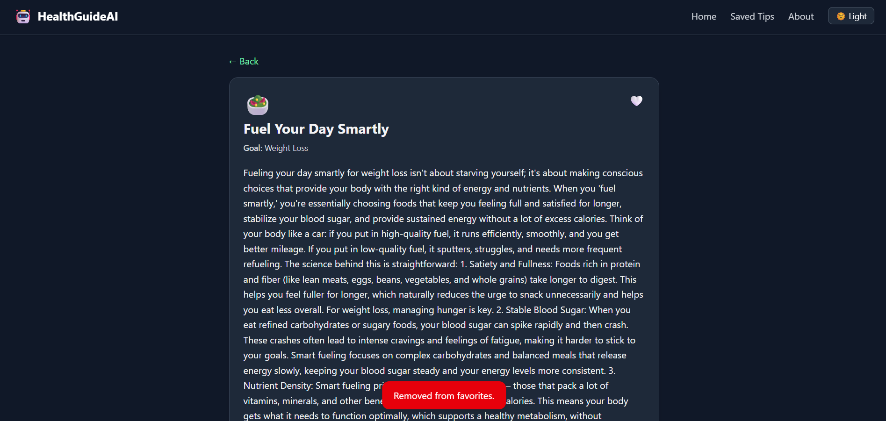 |


---

# **6. Known Issues / Improvement Areas**

## **Current Limitations**

* AI may occasionally repeat similar tips
* Free Gemini quota limits usage
* Saved tips are per-browser (no backend)
* No multiple-user separation
* Duplicate tips from different session may get saved since IDs of tips are session-based
* Refresh clears generated tips (context reset)
* Icons may sometimes be unrelated

## **Possible Improvements**

* Backend with user login + cloud sync
* Multi-language support (English/Hindi/etc.)
* Share tips as PDF/image
* Text-to-speech narration
* Habit tracker or streak system
* Weekly AI wellness report
* Improve tip deduplication logic

---

# **7. Bonus Work**

This project includes several polished enhancements that go **beyond** the basic assignment requirements:

### **UI & Experience Improvements**

* **Dark Mode Toggle** with theme persistence
* **Smooth Framer Motion animations** across components
* **Popup notification system** for success/error messages
* **Typewriter animation** for long AI-generated text
* **Auto-scroll** to generated tips
* **Animated Save/Unsave button**
* **Smart age validation** (12–100)
* **Strict emoji enforcement** for aesthetic consistency
* **Context-based state management** for smooth navigation
* **Sequential reveal animation** for long explanation → steps → progress
* **Skeleton loaders** while generating tips

These enhancements significantly elevate the overall **usability**, **smoothness**, and **professional feel** of the application.


---
